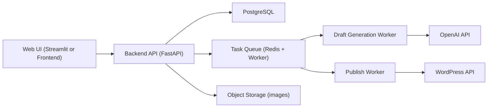

# Day 2: 시스템 아키텍처 설계 초안

## 1) 목표
Day 2의 목적은 BlogSnap을 "데모 앱"에서 "운영 가능한 서비스 구조"로 확장하기 위한 시스템 경계를 정의하는 것입니다.

핵심 목표:
- 프론트/백엔드/작업큐/DB 역할 분리
- 글 생성과 업로드를 비동기 작업으로 안정화
- 상태 추적(초고 생성/선택/업로드 결과) 가능 구조 확보

## 2) 아키텍처 개요
현재 MVP는 Streamlit 단일 앱 구조입니다. Day 2 이후에는 아래 구조를 기준으로 확장합니다.

## 3) 컴포넌트 책임
### UI
- 글 종류/키워드/사진/감정 강도 입력
- 생성 요청 전송, 초고 리스트 조회
- 초고 선택 후 업로드 요청
- 작업 상태(대기/진행/완료/실패) 표시

### Backend API (FastAPI)
- 인증/권한(후속 Day)
- 요청 검증 및 도메인 상태 전이 관리
- 작업 큐에 생성/업로드 Job enqueue
- 결과 조회 API 제공

### Worker
- `Draft Generation Worker`: OpenAI 호출로 초고 2~3개 생성
- `Publish Worker`: 선택 초고를 WordPress에 게시
- 실패 시 재시도/로그 적재

### Database (PostgreSQL)
- 사용자 입력/초고/작업 상태/업로드 이력 영속화
- 장애 분석 가능한 로그 데이터 저장

### Object Storage
- 업로드 이미지 보관(원본/가공본)
- 워커가 접근 가능한 공유 스토리지 제공

## 4) 주요 데이터 흐름
### A. 초고 생성
1. UI가 `POST /v1/drafts/generate` 호출
2. API가 `draft_generation_job` 생성 후 큐 enqueue
3. Worker가 OpenAI 호출 후 초고 2~3개 저장
4. UI는 `GET /v1/jobs/{id}` 폴링 또는 SSE로 상태 수신
5. 완료 시 `GET /v1/drafts?project_id=...`로 결과 표시

### B. 초고 선택 업로드
1. UI가 선택 초고 ID로 `POST /v1/publish` 호출
2. API가 `publish_job` 생성 후 큐 enqueue
3. Worker가 WordPress 업로드(이미지+본문+태그)
4. 결과 URL/실패원인을 `publish_log`에 저장
5. UI가 최종 성공 링크 표시

## 5) API 경계(초안)
### Draft
- `POST /v1/drafts/generate`
  - input: `project_id`, `post_type`, `keyword`, `sentiment`, `image_asset_id`, `draft_count(2|3)`
  - output: `job_id`
- `GET /v1/drafts?project_id=...`
  - output: draft list
- `POST /v1/drafts/{draft_id}/regenerate`
  - output: `job_id`

### Publish
- `POST /v1/publish`
  - input: `project_id`, `draft_id`, `provider=wordpress`
  - output: `job_id`
- `GET /v1/publish/{job_id}`
  - output: `status`, `post_url`, `error_message`

### Job / Asset
- `GET /v1/jobs/{job_id}`
- `POST /v1/assets/upload` (presigned URL 또는 직접 업로드)

## 6) 상태 모델(초안)
### Job Status
- `PENDING`
- `RUNNING`
- `SUCCEEDED`
- `FAILED`
- `RETRYING`

### Draft Status
- `GENERATED`
- `SELECTED`
- `ARCHIVED`

### Publish Status
- `REQUESTED`
- `PUBLISHED`
- `ERROR`

## 7) 운영/신뢰성 설계 포인트
- OpenAI/WordPress 호출 타임아웃 분리 설정
- 네트워크 실패 시 지수 백오프 재시도
- Idempotency key로 중복 게시 방지
- 구조화 로그(JSON) + request_id/job_id 추적
- 장애 시 재처리 가능한 관리자 재실행 엔드포인트 준비

## 8) 보안 설계 포인트
- API 키/앱 패스워드 비밀관리(환경변수 + Secret Manager)
- 사용자 업로드 파일 MIME/크기 검증
- 권한 없는 프로젝트 접근 차단(후속 Day 5)
- 민감 정보 로깅 금지

## 9) Day 2 산출물 체크리스트
- [x] 시스템 구성요소와 책임 정의
- [x] 생성/업로드 데이터 흐름 정의
- [x] API 경계 초안 정의
- [x] 상태 모델 초안 정의
- [x] 운영/보안 리스크 포인트 정의

## 10) Day 3로 넘길 결정 사항
- [x] DB 테이블 상세 스키마 확정 (users/projects/drafts/jobs/publish_logs/assets)
  - 산출물: [docs/day3-db-schema.md](/Users/jin/Desktop/easy_ing/BlogSnap/docs/day3-db-schema.md), [db/migrations/0001_init.sql](/Users/jin/Desktop/easy_ing/BlogSnap/db/migrations/0001_init.sql)
- [x] enum/인덱스 전략 확정
  - 산출물: [docs/day3-db-schema.md](/Users/jin/Desktop/easy_ing/BlogSnap/docs/day3-db-schema.md)
- [x] Job retry 정책 수치 확정(횟수/간격/최대 지연)
  - 산출물: [docs/day3-retry-policy.md](/Users/jin/Desktop/easy_ing/BlogSnap/docs/day3-retry-policy.md)
